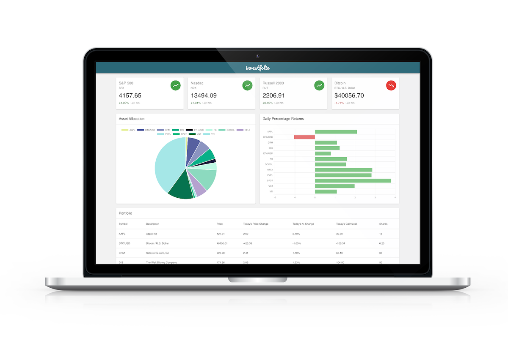

# Investfolio

Investment portfolio dashboard and stock / crypto tracking application



## Technologies Used

* [React](https://github.com/facebook/react)
* [Express](http://expressjs.com/)
* [MySQL](https://github.com/sidorares/node-mysql2)
* [Sequelize](https://sequelize.org/)
* [MaterialUI](https://material-ui.com/)
* [Chart.js](https://www.chartjs.org/)

## API Dependencies
* [Finnhub](https://finnhub.io/) - Stock & Crypto Market Data
* [twelvedata](https://twelvedata.com/) - Market Index Data

## Getting Started

These instructions will get you a copy of the project up and running on your local machine for development and testing purposes.

```
npm install
```
* Create .env file and add the following with your credentials

```
FINNHUB_API_KEY=
TWELVEDATA_API_KEY=

DB_HOST=
DB_USER=
DB_PW=
```
* Initilize the database
```
npm run db-init
```
* Seed the database with mock data
```
npm run db-seed
```
* Start the server
```
npm run start-dev
```
* Start the webpack build process
```
npm run build-dev
```
* Open the browser
```
http://localhost:3000/
```